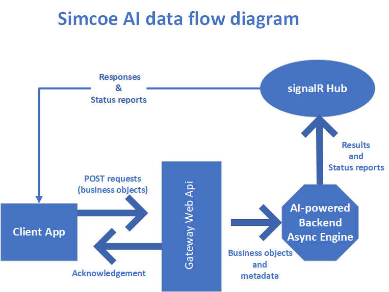

# Simcoe AI application workflow overview
Simcoe AI is a complex, secure, cloud-hosted and AI-powered application that employs sophisticated algorithms to determine the closest talent match to a given initiative or job description contextually. Its world-class security implementation brings a lot of peace of mind when integrating it with other Human Resource and ATS applications.

## Simcoe AI is scalable
The application's power is at the user's disposal, and it scales out automatically on the cloud to harness more resources to search applicants' resumes. This demand-driven architecture lets the system match talents to the job description more rapidly and efficiently when needed.

## Simcoe AI is a multi-user application
The application has been architectured and designed to accommodate a team of HR users at a company. The administrator who signed up on behalf of the company can easily add or remove team members to work collaboratively.

## Simcoe AI is secure
Simcoe AI has been integrated with Microsoft Azure Active Directory to operate as a secure entity. This integration ensures that the requests made to the backend are legit and authentic.

## Simco AI is event-driven
Simcoe AI's architecture is event-driven and it informs the users once the results are ready. Requests can be placed by a simple Web Api and the results are relayed back to the caller by web socket technology asynchronously.

## Simcoe AI's lake of resumes
Resumes in any format like Microsoft Word, PDF or plain text are retained in "Lakes" where they can be searched based on the job descriptions stored in the system's repository. Each team member within the company account can choose any lakes available to run their search campaigns against any given job descriptions.

## Simcoe AI's interview
Users can design interviews and get them sent to the short-listed higheset-ranked candidates. There is an algorithm that collects candidates' answers and combines them with search results to compute the final candidates' scores.

## Simcoe AI's chatbot
Coming soon. Please stay tuned by leaving us your email address at [Simcoe AI's website](https://simcoe.ai).

## The high-level picture
The application compromises a handful number of major components working together to deliver a short-listed candidates choice for further vetting.

### Asynchronous request/response pattern
The architecture of the application allows the integrated client applications submit web requests to the Gateway Api and receive an acknowledgment almost immediately. The Gateway Api submits the request to the backend and once the results are ready, they are comunicated to the integrated client application by web sockets in a real-time fashion.

The following diagram depicts this mechanism:

### Major components of the system
TThe system compromises the following major components:

* A set of repositories to retain talents' resumes named as "Lake of resumes"
* Another set of repositories to retain job descriptions in text format
* AI-powered matching engine to contextually look up lake of resumes based on a given job description.
* Interview component to receive the short-listed candidates contact info e.g. email addresses to deploy HR-designed interview questions to them
* Scoring component to rank interview results
* Formula system
* Ranking engine to sort the results based on the overal combined score that short-listed candidates obtained

### Examples on populating lake of resumes
Gateway Web Api is a scalable entity that can handle an enormous number of requests in parallel. Therefore, it can import resumes very efficiently in mass and store them in their designated lake of resumes. The following examples illustrate some integration forms with Simcoe AI's web api:

* A UI app to run mass upload
* An offline job to read resumes from a database and get them imported into the lake
* An application that receives emails with a particular subject and an attached resume
* A company's ATS
* A Microsoft OneDrive folder, Google drive, dropbox, etc.

## Simcoe AI sequence diagram

Simceo AI's sequence diagram is available [here](simcoe-ai-sequence-diagram.md).

## Simcoe AI API documentation

A thorough document of Typescript code, submitted payloads and received responses via signalR is [found here](Requests.md).

[Home](README.md) 

