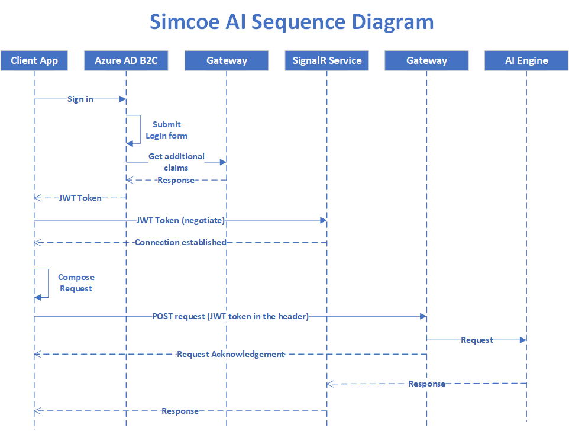

# Simcoe AI sequence diagram

The following diagram depicts the sequence of application starting from the client app e.g. UI client app, ATS, etc. to the last tier. The Gateway Web Api, as it appears, facilitates collecting requests and passes them to the backend's AI engine.

## A note on Gateway security

One of the key elements of Gateway Api is that it provides Azure AD B2C a couple of claims for further security enhancements.

## Security UX

The UX aspect of integration with [Azure AD B2C](https://azure.microsoft.com/en-us/services/active-directory/external-identities/b2c/) is managed by Simceo AI Inc. and the client app developers do not need to create or use an existing instance of Azure AD B2C.

## Simcoe AI's Application workflow

An overview of Simcoe AI's application workflow can be found [here](app-workflow-overview.md).

## Simcoe AI API documentation

A thorough document of Typescript code, submitted payloads and received responses via signalR is [found here](Requests.md). 

[Home](README.md) 

Copyright 2021 &copy; [Simcoe AI Inc.](https://simcoe.ai) All rights reserved.
